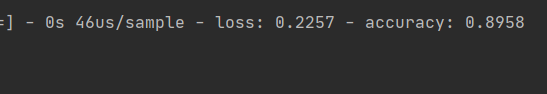

# Cloth-Recognition
Made by Damian Żółtowski 246651 on 07.06.2020
  
  

## Introduction
&nbsp;&nbsp;&nbsp;&nbsp;&nbsp;&nbsp;Celem zadania była implementacja modelu, który pozwoli
zakwalifikować zdjęcia reprezentujące ubrania. 
 
&nbsp;&nbsp;&nbsp;&nbsp;&nbsp;&nbsp;Aby tego dokonać należało pobrać odpowiednie pliki 
zawierające dane testowe oraz walidacyjne z gita zalandoresearch. Następnie należało 
zadeklarować odpowiednie metody pozwalające stwierdzić do jakiej grupy ubrań zdjęcie ze 
zbioru walidacyjnego należy. W naszym przykładzie klasyfikujemy obiekty na 10 różnych
etykiet, którymi są:   
 * T-shirt/top
 * Trouser
 * Pullover
 * Dress
 * Coat
 * Sandal
 * Shirt
 * Sneaker
 * Bag
 * Ankle boot  

&nbsp;&nbsp;&nbsp;&nbsp;&nbsp;&nbsp;Naszymi danymi wejściowymi są ciągi testowe oraz
walidacyjne. Ciągi testowe zawierają 60.000 egzemplarzy każdy, przy czym ciąg X_train
zawiera obrazy w rozdzielczości 28x28 px. a y_train zawiera etykiety charakteryzujące 
dane. Ciągi walidacyjne natomiast mają 10.000 egzemplarzy danych o podobnej charakterystyce
co ciągi treningowe.  

&nbsp;&nbsp;&nbsp;&nbsp;&nbsp;&nbsp;Dane wyjściowe to dokładność z jaką nasz algorytm potrafił
będzie określić jaki przedmiot znajduje się na danym zdjęciu. Do tego zadania użyłem algorytmu 
modelu dyskryminującego K- Nearest Neighbours oraz posiłkując się materiałami dostępnymi na 
internecie zaprojektowałem sieć neuronową rozwiązującą problem klasyfikacyjny, wykorzystując
algorytm optymalizujący [Adam](https://www.tensorflow.org/api_docs/python/tf/keras/optimizers/Adam), 
natomiast jako funkcję błędu wykorzystałem algorytm categorical crossentropy, który wylicza funkcję straty
między etykietami a ich predykacjami, używany tam gdzie jest więcej niż 2 etykiety, i który oczekuje, że
podane etykiety będą w tzw. reprezentacji one hot. Oznacza to, że etykiety będą reprezentowane binarnie,
a wektor y reprezentowany jako etykiety, np. [0, 1, 2, 3, 4], stanie się macierzą o następującym wyglądzie:
[[1, 0, 0, 0, 0], [0, 1, 0, 0, 0], [0, 0, 1, 0, 0], [0, 0, 0, 1, 0], [0, 0, 0, 0, 1]]. A więc pozycja 1 w 
rzędzie macierzy odpowiada do jakiej etykiety dany przedmiot będzie należał.

&nbsp;&nbsp;&nbsp;&nbsp;&nbsp;&nbsp;Wszystkie ciągi zawierające obrazy zostały przekształcone na typ float
oraz podzielone na max. wartość pixela równą 255 w celu optymalizacji operacji matematycznych, ponieważ
wydaje się to być najefektywniejszy zakres liczbowy w jakim komputer może pracować.
## Methods

##### KNN ALGORITHM
&nbsp;&nbsp;&nbsp;&nbsp;&nbsp;&nbsp;Czerpiąc wiedzę uzyskaną na laboratoriach numer dwa, postanowiłem zaimplementować pierwszy model dyskryminujący
jakim jest KNN. Jest to model nieparametryczny, czyli taki, dla którego parametrami modelu są dane uczące. 
Rozwiązanie tego problemu owym algorytmem sprowadza się do predykcji etykiety danego obrazu na podstawie, podobieństwa jakie ma ono z innymi obrazami.
W przypadku klasyfikacji testów i ich etykiet korzystaliśmy z metryki Hamminga, która opierała się na zwykłym porównaniu tekstów, czy słowo występuje,
czy też nie.  

&nbsp;&nbsp;&nbsp;&nbsp;&nbsp;&nbsp;Tutaj natomiast nie możemy wykorzystać tej metody dlatego, że wartość pixela waha się w przedziale od 0 do 255.
Dlatego też jesteśmy zmuszeni użyć tutaj innej metryki. Można wykorzystać metrykę Euclidesową albo metrykę Manhatanna. Ta druga została zaimplementowana
w moim programie, a od Euclidesowej różni się jedynnie tym, że zamiast wartości bezwzględnej różnicy między pixelami, podnosimy je do kwadratu a następnie 
pierwiastkujemy.

&nbsp;&nbsp;&nbsp;&nbsp;&nbsp;&nbsp;Jest to kluczowa funkcja, która pomoże nam wyselekcjonować K najbliższych sąsiadów.
Następnie w funkcji **sort_train_labels()** sortujemy etykiety klas poprzez macierz odległości uzyskując posortowaną macierz etykiet obrazów.

&nbsp;&nbsp;&nbsp;&nbsp;&nbsp;&nbsp;Po czym możemy policzyć prawdopodobieństwo p(y|x) wystąpienia etykiety y dla danego ciągu x. Czyli po prostu
dla każdej etykiety sumujemy ilość jej wystąpień w pierwszych k elementach każdego wierza macierzy y. Po czym dzielimy je na k otrzymując średnie
prawdopodobieństwa przynależności do poszczególnych klas. 

 
&nbsp;&nbsp;&nbsp;&nbsp;&nbsp;&nbsp; Następnym krokiem było obliczenie błędu klasyfikacji, który polegał na sprawdzeniu ile obrazów zostało poprawnie
zakwalifikowanych przez nasz program jako odpowiadające im etykiety, przyrównując predykowane etykiety do zbioru walidacyjnego y_val.

 

&nbsp;&nbsp;&nbsp;&nbsp;&nbsp;&nbsp;Teraz należałó wybrać model, o najmniejszym błędzie klasyfikacji, przy róznych wartościach k.
Wykonałem klasyfikację modeli na podstawie ciągów walidacyjnych i testowych oraz ciągu zawierającego różną liczbę sąsiadów.
Funkcja zwraca najlepszą dokładność jaką udało się uzyskać oraz liczbę K sąsiadów, dla której owa wartość wystąpiła.

#### NEURON NETWORK APPROACH

&nbsp;&nbsp;&nbsp;&nbsp;&nbsp;&nbsp;Zdecydowałem się spróbować napisać sieć neurnową do tego zadania, ponieważ bardzo ciekawiło
mnie jak się to robi i jakie mogą być rezultaty. Okazuje się, że wynik jest bardzo podobny w obydwu przypadkach, jendakże dobrze
zoptymalizowana sieć neuronowa potrafi ten sam problem klasyfikacyjny rozwiązać w minutę, kiedy na algorytm KNN potrzeba około 
pół godziny. Sieć napisana jest przy pomocy pakietu tensorflow oraz bibliotek, jakie on oferuje.  

&nbsp;&nbsp;&nbsp;&nbsp;&nbsp;&nbsp;Sieci neuronowe muszą mieć poprawnie przygotowane dane, tj. na wejściu dane muszą mieć 
identyczne rozmiary. U nas obrazy mają rozmiar 28x28 pixeli więc przedstawiłem je w wektor charakterystyk o wielkości 1x784
(28 * 28 = 784).  

&nbsp;&nbsp;&nbsp;&nbsp;&nbsp;&nbsp;Do zaimplementowania sieci neuronowej skorzystałem z interfejsu sekwencyjnego, który jest
nieco prostszy w implementacji i wystarcza na wykonanie tego zadania. Configuracja sieci wygląda nastepująco:  

&nbsp;&nbsp;&nbsp;&nbsp;&nbsp;&nbsp;Na początku zdefiniowałem wszystkie etykiety występujące w danym problemie klasyfikacyjnym.
Po czym utworzyłem instancję klasy Sequential, która tworzy nam podstawową sieć neuronową.  

&nbsp;&nbsp;&nbsp;&nbsp;&nbsp;&nbsp;Teraz należało ją zoptymalizować. Na początku konfigurowania sieci musimy podać jaki rozmiar
danych będzie wprowadzany do sieci na wejściu. Służy do tego funkcja **add(Flatten(input_shape=(28,28)))**, która informuje sieć, że
dane wprowadzane będą miały format spłaszczonej macierzy 28x28, przyjmujacej postać wektora 1x784. Następnie za pomocą funkcji 
**add(Dense())** dodajemy kolejne warstwy do sieci neuronowej odpowiedzialne za przekazywanie danych i operacje na nich. Liczba która
stoi jako pierwsza w owej funkcji odpowiada za ilość neuronów jaka znajdzie się w tworzonej warstwie sieci, a argument activation oznacza
funkcję aktywacji jaka zostanie zastosowana na danych. W moim przypadku jest to funkcja sigmoid, zwracająca liczby z przedziału [0, 1],
które można interpretować jako prawdopodobieństwo. Warstwy gęste, czyli Dense, są dostępne dla każdych innych neuronów w kolejnych jak
i poprzednich warstwach. Oznacza to, że każdy neuron z warstwy wcześniej może połączyć się z neuronem warstwy późniejszej. 

&nbsp;&nbsp;&nbsp;&nbsp;&nbsp;&nbsp;W celu lepszej optymalizacji modelu i uniknięcia sytuacji overfittingu wykorzystałem funkcję **Dropout()**, powodującą ustawienie losowych neurnów na
wartość 0. Ilość neuronów jest specyfikowana w argumencie funkcji i oznacza procent wszystkich neuronów w kolejnej warstwie. W ten sposób
nasza sieć będzie uczyła się danych wolniej i unikniemy sytuacji gdzie po kilku pierwszych przejściach sieć zapisze sobie większość danych
treningowych.

&nbsp;&nbsp;&nbsp;&nbsp;&nbsp;&nbsp;Na koniec musimy zdefiniować tak zwaną funkcję wyjścia, za którą przyjąłem softmax. Ta funkcja transformuje 
dane wyjściowe tak, aby znalazły się w przedziale [0, 1] i sumowały razem do 1, tak aby móc uznać wartości wyjściowe jako prawdopodobieństwo.

&nbsp;&nbsp;&nbsp;&nbsp;&nbsp;&nbsp;Po takiej konfiguracji należy jeszcze określić funkcję błędu oraz funkcję, która ten błąd będzie optymalizować.
Zastosowałem tutaj funkcję błedu categorical crossentopy (stosowanej do tzw.multi-class classification, gdzie mamy 2 lub więcej ekskluzywnych klas),
która będzie optymalizowana przez algorytm ADAM.

&nbsp;&nbsp;&nbsp;&nbsp;&nbsp;&nbsp;Teraz można przystąpić do nauki sieci neuronowej. Wykonujemy to na danych treningowych, podając liczbę epok i rozmiarów
batchy, na które zbiór treningowy zostanie podzielony. Podajemy też procent, jaki zostanie wykorzystany z danych treningowych, jako dane walidacyjne. 
Po wytrenowaniu sieci neuronowej przystępujemy do walidacji danych podając jako argumenty zbiory walidacyjne oraz rozmiar batchy na jaki zostaną podzielone 
zbiory. Metodą prób i błędów doszedłem do wniosków, że uczenie sieci będzie optymalne przy 50 epokach, batchach o rozmiarze 32 oraz proporcją 0.2/0.8 danych
walidacyjnych z danych treningowych. Analogicznie przy ewaluacji modelu optymalną liczbą batchy okazała się liczba 32.

&nbsp;&nbsp;&nbsp;&nbsp;&nbsp;&nbsp;Tak więc stworzyliśmy tutaj model, który optymalizowany jest przez funkcję wcześniej nie używaną na zajęciach ADAM oraz
sieć neuronową, która dane wielokrotnie modyfikuje opakowując je w funkcję sigmoidalne, a następnie sprowadza je do przedziału [0, 1], abyśmy mogli wyznaczyć
prawdopodbieństwo. 
 
## Results

&nbsp;&nbsp;&nbsp;&nbsp;&nbsp;&nbsp;Szukając wyników na benchmarku możemy spotkać się z następującymi wynikami dla algorytmu KNeareastNeighbours:

&nbsp;&nbsp;&nbsp;&nbsp;&nbsp;&nbsp;Maksymalny osiąga 86%, natomiast mój algorytm KNN osiąga wartość 0.859

&nbsp;&nbsp;&nbsp;&nbsp;&nbsp;&nbsp;Moja siatka neuronowa potrafi dojść do precyzji równej 0.896. A przy zbiorach walidacyjnych osiąga
skuteczność bliską 95%. 

&nbsp;&nbsp;&nbsp;&nbsp;&nbsp;&nbsp;Na benchmarku możemy jeszcze zobaczyć, że najlepsze precyzje uzyskały osoby stosujące algorytm SVC i prezentują się następująco:

#Model summary

## Usage

&nbsp;&nbsp;&nbsp;&nbsp;&nbsp;&nbsp;Aby uruchomić program wystarczy zaciągnąć repozytorium z gita a następnie uruchomić plik main i obserować konsolę w celu odczytania wyników.
Aby osiągnąć te wyniki co ja nie należy nic zmieniać w plikach, a tylko uruchomić program. Algorytm KNN dosyć długo się ładuje (okolice 30-45min u mnie), a sama sieć neuronowa to
granice 5-10 minut.

&nbsp;&nbsp;&nbsp;&nbsp;&nbsp;&nbsp;Można pobawić się parametrami wywołania funkcji zmienić liczbę epok, batchy czy neuronów, wszystko to w jakimś stopniu wpłynie na wartość rozwiązania. Wartości 
obrane przezemnie zostały przetestowane z różnymi kombinacjami i w takiej konfiguracji okazały się być optymalne.

&nbsp;&nbsp;&nbsp;&nbsp;&nbsp;&nbsp;Jeśli chcielibyśmy przetestować sam KNN bądź samą sieć nalezy odkomentować sekcję TEST w klasie, która nas interesuje i uruchomić tę klasę.

&nbsp;&nbsp;&nbsp;&nbsp;&nbsp;&nbsp;Aby sam program zadziałał wymagana jest:
* biblioteka NumPy
* Python w wersji 3.+
* środowisko programistyczne do Pythona np. PyCharm
* katalogi data, pictures oraz utils zawarte w tym repozytorium
* bilbioteka tensorflow

## Przypisy
Robiąc to zadanie inspirowałem się poniższymi źródłami, jednak sama optymalizacja samej sieci odbyła się metodą prób i błędów testując różne kombinacje, które udało
mi się wymyśleć.
* [Zalando github](https://github.com/zalandoresearch/fashion-mnist)
* [Neural network tutorial](https://miroslawmamczur.pl/przykladowa-siec-neuronowa-mlp-w-tensorflow/?fbclid=IwAR35Pj0r1ul3cFH0RMnKZabto7Er0AfQN7vT9wfrbgq_RIm8ZnM3Ti_INaA)
* [KNN image classification](https://medium.com/@YearsOfNoLight/intro-to-image-classification-with-knn-987bc112f0c2)
* [KNN structure](https://www.ii.pwr.edu.pl/~zieba/zad2_msid.pdf)